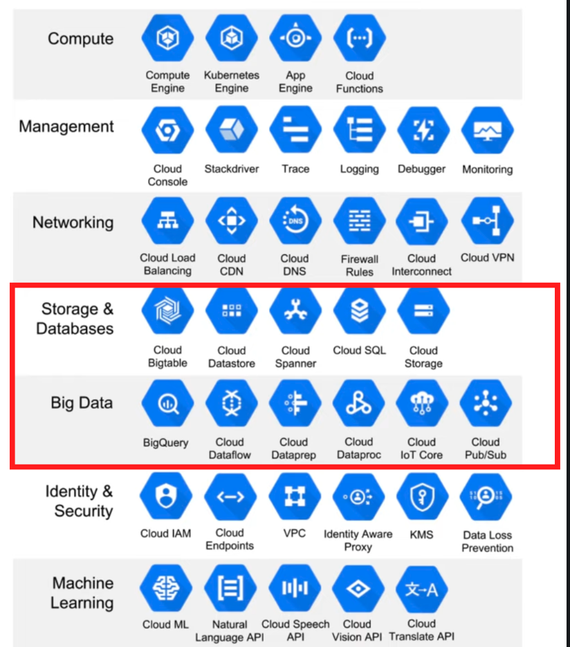

# GCP (Google Cloud Platform)

## What is it?

- Cloud computing services offered by Google.
- Includes a range of hosted services for compute, storage, and application development that runs on Google hardware.
- Same hardware on which Google run its services like Search, Gmail, and YouTube.

## GCP Services

- We mainly focus on "Storage and Databases" and "Big Data" services in GCP.

    

# Terraform

