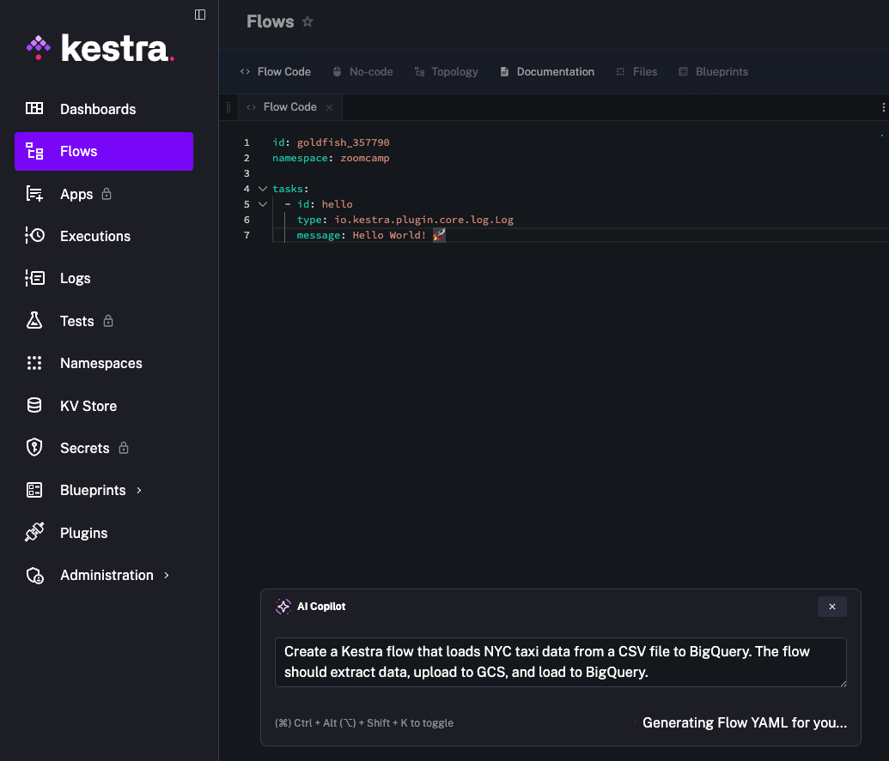

# What is Workflow Orchestration?

- Workflow Orchestration is comparable to a **music orchestra** where various instruments (tools like Python or databases) are managed by a **conductor** (the orchestrator, such as Kestra).
- **Core Function**: The orchestrator ensures that independent tools, which might otherwise require **manual steps** to communicate, work in unison to move and process data.
- **Operational Visibility**: Orchestrators provide vital **logging information** and **monitoring**, allowing engineers to track interactions between tools and identify failures.

## Key Capabilities of an Orchestrator

- **Automation**: Workflows can be triggered **automatically** based on a predefined **schedule** or through **event-based triggers**, such as when new data becomes available.
- **Complex Logic**: Beyond simple sequencing, orchestration allows for advanced logic, including **parallel execution** and **looping through tasks**, which individual tools may not support on their own.
- **Error Management**: It handles **predefined steps** for monitoring and logging errors, ensuring that extra steps can be taken automatically when failures occur.

## Data Engineering Pipeline Patterns

- **ETL (Extract, Transform, Load)**: A fundamental process where data is extracted from a source, transformed (e.g., using a Python script), and then loaded into a database like Postgres.
- **ELT (Extract, Load, Transform)**: A more modern approach often utilising **cloud environments** like **Google Cloud Storage** and **BigQuery**. This method allows data to be loaded into a cloud warehouse before transformation, highlighting the benefits of cloud stability.
- **Data Movement**: In data engineering, the orchestrator is essential for managing the flow of data from one location to another while maintaining **visibility** over any modifications made during the process.

## Modern Data Engineering Enhancements

- **AI Integration**: Modern orchestration platforms like Kestra now incorporate AI co-pilots to assist in building workflows.
- **Context Engineering**: This is a specific concept used within AI-enhanced data engineering to improve the efficiency and intelligence of data pipelines.
- **Production Management**: Transitioning from development to production involves specific processes for **deploying and managing** pipelines to ensure they remain robust and reliable.

# Install Kestra

```sh
cd codes/02/install-kestra
docker-compose up -d    # to start up kestra, postgres and pgadmin, and a postgres (for kestra data)
docker-compose down     # to stop kestra
```

# AI Copilot in Kestra

- Add to docker-compose.yaml the following:

```yaml
kestra:
  image: kestra/kestra:v1.1
  environment:
    KESTRA_CONFIGURATION: |
      ai:
        type: gemini
        gemini:
          model-name: gemini-2.5-flash
          api-key: ${GEMINI_API_KEY}
```

- Export to local environment variables so we don't expose the Gemini API Key

```sh
export GEMINI_API_KEY=
```

<p>
	
</p>