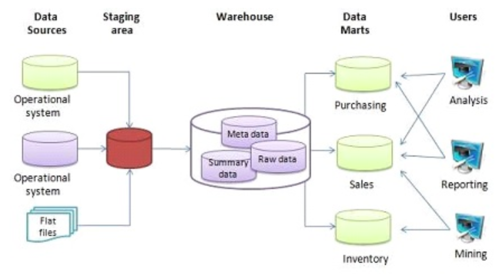
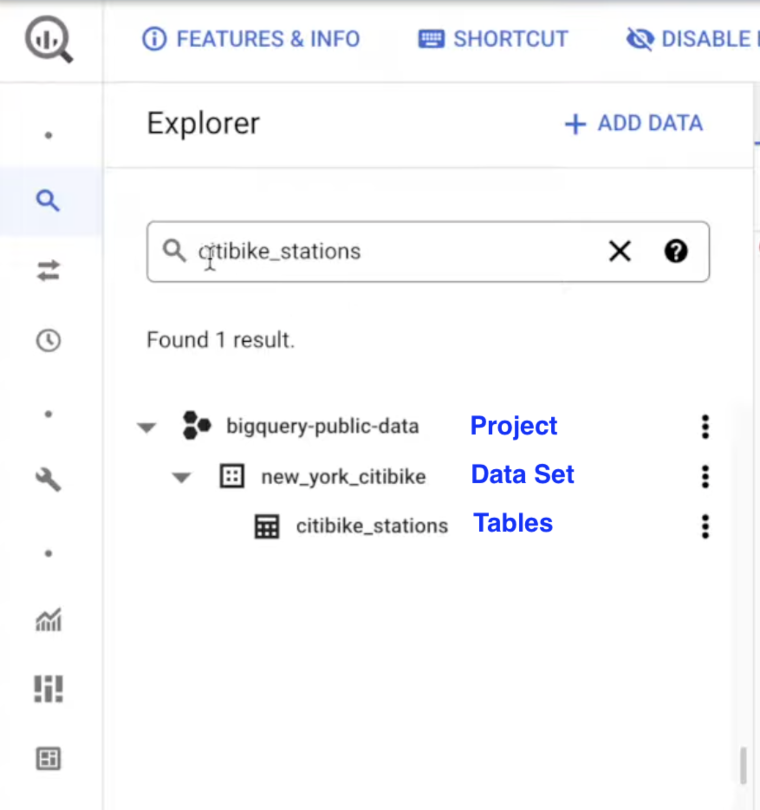
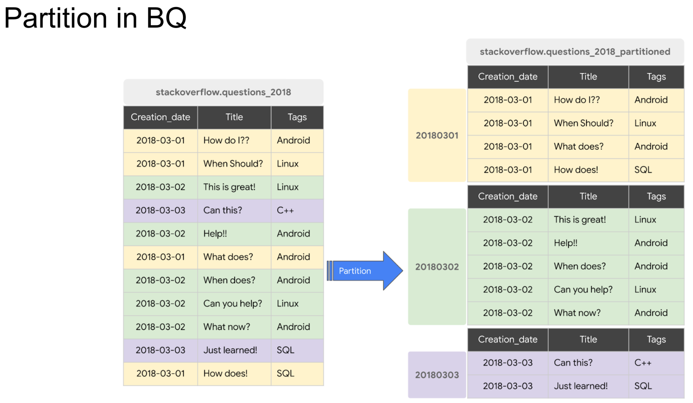
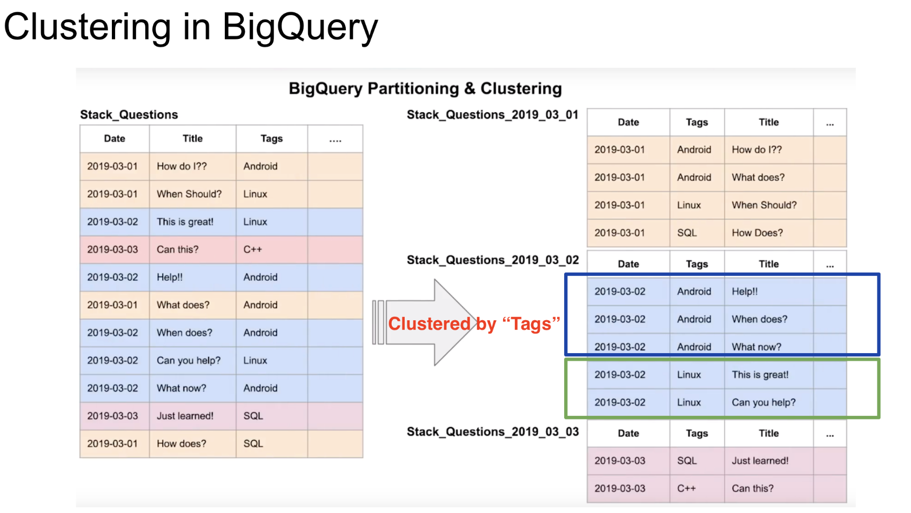
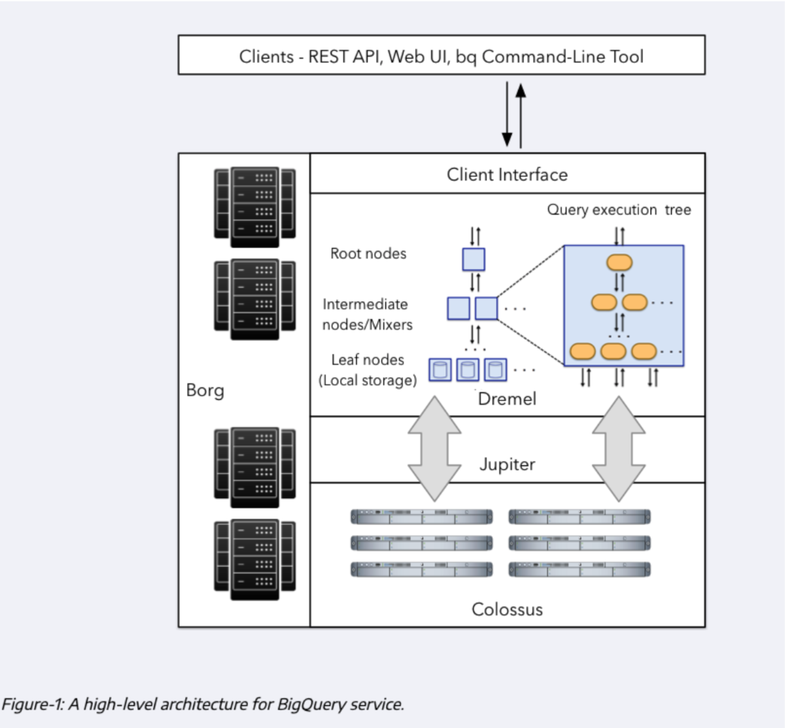
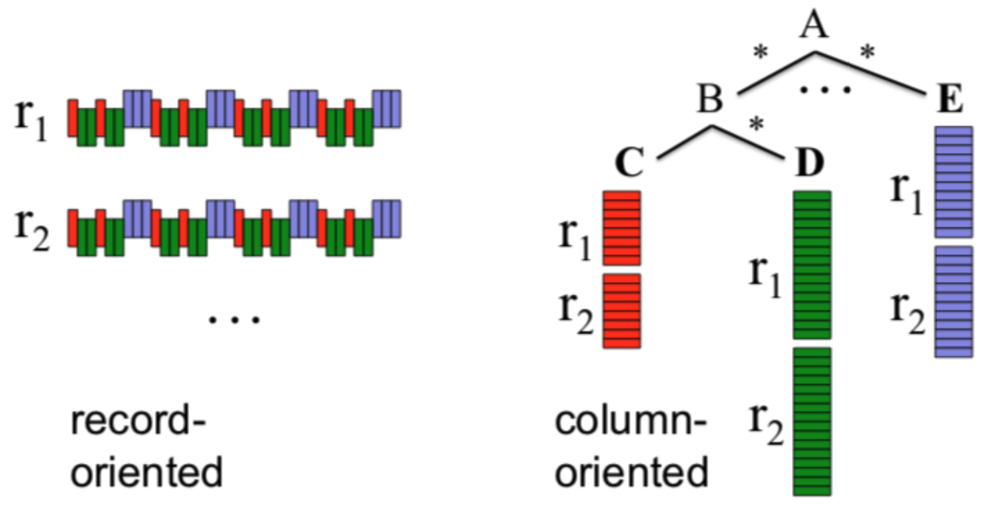
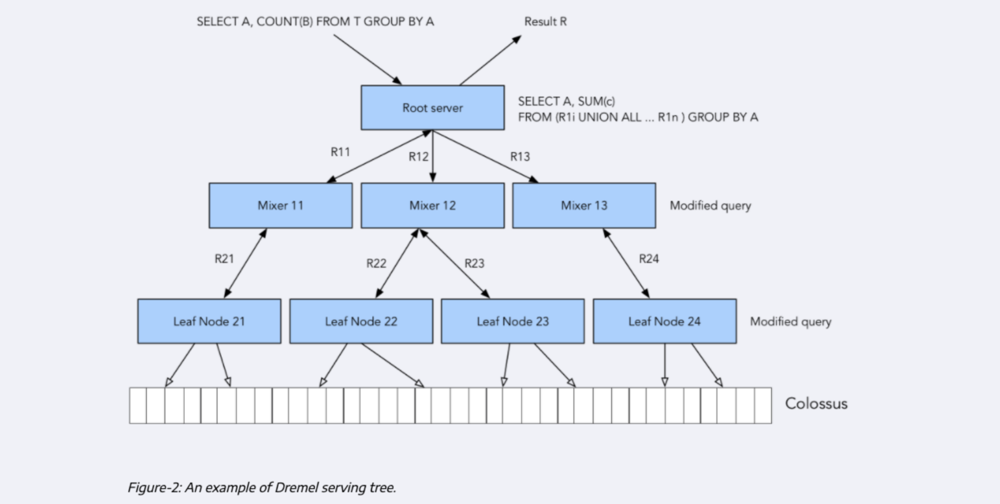
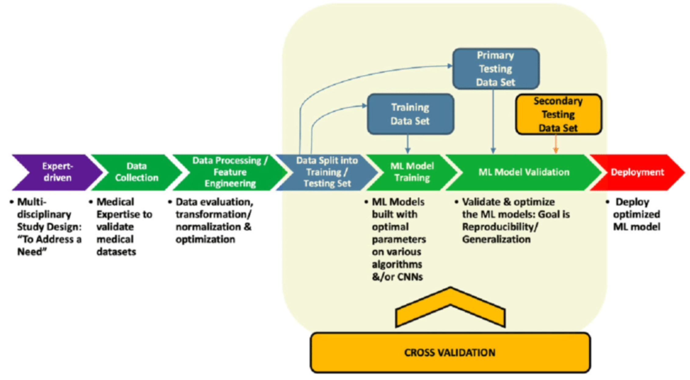
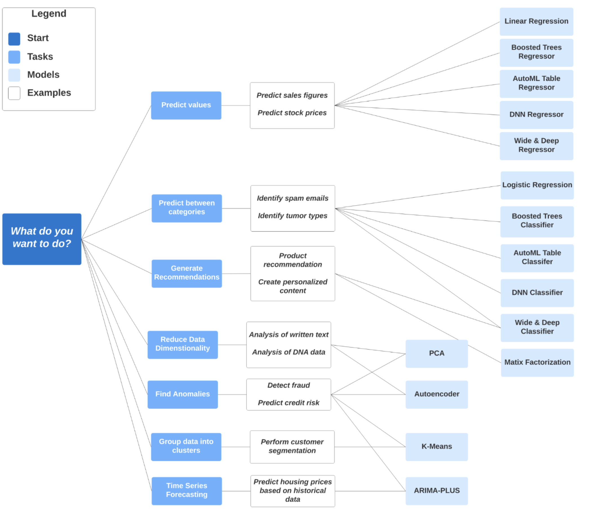

# Data Warehouse and BigQuery

## OLTP vs OLAP

| Feature             | OLTP (Online Transaction Processing)                                         | OLAP (Online Analytical Processing)                                      |
| ------------------- | ---------------------------------------------------------------------------- | ------------------------------------------------------------------------ |
| Purpose             | Control and run essential business operations in real-time.                  | Plan, solve problems, and discover hidden insights for decision support. |
| Data Updates        | Short, fast updates initiated by the user.                                   | Periodically refreshed via scheduled, long-running batch jobs.           |
| Database Design     | Normalized databases designed for operational efficiency.                    | Denormalized databases designed for analysis.                            |
| Space Requirements  | Generally small, provided historical data is archived.                       | Generally large due to the aggregation of massive datasets.              |
| Backup and Recovery | Regular backups are required for business continuity and legal requirements. | Lost data can be reloaded from the OLTP database as required.            |
| Productivity        | Increases the productivity of end users.                                     | Increases the productivity of business managers and data analysts.       |
| Data View           | Focuses on a list of day-to-day business transactions.                       | Provides a multi-dimensional view of enterprise data.                    |
| User Examples       | Online shoppers, clerks, and customer-facing personnel.                      | Knowledge workers, business analysts, and executives.                    |

## Understanding Data Warehousing

A data warehouse is a system specifically designed for **reporting and data analysis**, known as **OLAP** (Online Analytical Processing) solution.
Unlike standard databases used for daily transactions, a warehouse is built to help users discover hidden insights from massive amounts of data.

- **OLTP vs OLAP**: Standard databases (**OLTP**) handle fast, small updates for tasks like online shopping.
  In contract, **OLAP** (the data warehouse) handles **periodically refreshed, very large datasets** and is used primarily by data analysts and executives.
- **Data Structure**: Warehouses typically use **denormalised data** for better analytical efficiency.

    

- **Data Flow**: Information usually flows from various sources (like operating systems or transaction databases) into a **staging area**, which is then written into the data warehouse.
- **Data Marts**: The warehouse can be broken down into smaller "data marts" for specific departments, like sales or inventory, making it easier for different teams to access the information they need.

## Key Concepts of BigQuery

BigQuery is a modern data warehouse solution provided by Google that offers several unique advantages for handling **Big Data**.

- **Serverless Architecture**: There are **no servers to manage** and no software to install, which removes the burden of maintenance for a company.
- **Massive Scalability**: You can start with a few GB of data and easily scale up to **petabytes (PB)** without worrying about infrastructure.
- **Separation of Storage and Compute**: BigQuery stores data separately from the engine that runs queries. This is a major benefit for **cost control**, as your machine doesn't have to grow physically just because your data size increases.
- **Built-in Features**: It supports advanced tasks like **Machine Learning** (using a standard SQL interface), **geospatial analysis**, and **business intelligence** queries.

    

- **Interface Hierarchy**: Data is organized logically: **Project --> Data Set --> Tables**.

## Pricing and Performance Optimization

Efficiency in BigQuery is often about **reducing the amount of data scanned to save on costs**.

- **Pricing Models**:
  - **On-Demand Pricing**: You pay based on the amount of data your queries scan (e.g., $5 per TB).
  - **Flat-Rate Pricing**: A fixed monthly cost for a set number of "slots" (processing units), which only makes sense for very heavy users scanning over 200 TB per month.

    

- **Partitioning**: This involves dividing a table into segments based on a specific column, usually a **date**.
  When you query a partitioned table, BigQuery **only scans the relevant segments**, which drastically reduces processing costs and improves speed.

    

- **Clustering**: This groups similar data together within those partitions based on specific columns (like a "tag" or "ID").
  This further **refines performance** by allowing the system to skip over data that doesn't match your filters.
- **External Tables**: BigQuery can create "external tables" that allow you to query data directly from sources like **Google Cloud Storage** without actually moving the data into BigQuery itself.
  However, external tables are **slower, less optimized and usually more expensive per query**. They trade convenience for performance.

# Partitioning and Clustering

## Core Differences and Performance

- **Data Volume**: If you table contain **less than 1GB of data**, neither partitioning nor clustering is recommended, as they can actually increase costs due to metadata maintenance.
- **Cost Transparency**:
  - **Partitioning**: query costs are **known upfront**, allowing you to cancel queries that exceed a certain price.
  - **Clustering**: query costs are **not known upfront**, making it harder to predict expenses.
- **Column Limits**: Partitioning is typically restricted to **one column**, while clustering allows you to specify up to **four columns**.
- **Granularity**: Clustering provides **finer granularity** for filtering and aggregating data than partitioning can offer.

## Key Features of Partitioning

- **Structure**: Data is divided based on a **time unit** (daily, hourly, monthly, yearly), **ingestion time**, or an **integer range**.
- **Management**: It allows for **partition-level management**, meaning you can delete or move specific segments of data easily.
- **Limits**: There is a strict limit of **4000 partitions per table**.
- **Use Case**: Daily partitioning is the standard starting point, while **hourly partitioning** is useful for massive datasets that require processing every hour.

## Key Features of Clustering

- **Sorting Logic**: Data is **co-located** and sorted based on the order of the columns you select. The **order of these columns** is vital as it dictates the sort order of the table.
- **High Cardinality**: Clustering is the better choice when a column has a **large number of unique values** that would exceed the 4,000 partition limit.
- **Maintenance**: BigQuery provides **automatic re-clustering** in the background at **no cost** to the user, ensuring the table stays organized as new data is added.

## When to choose Clustering Over Partitioning

- **Small Segments**: Use clustering if partitioning would result in very small chunks of data (**less than 1GB per partition**).
- **Frequent Updates**: If you data is written or modified frequently across many different areas of the table, clustering is often more efficient.
- **Complex Filtering**: Choose clustering when your queries frequently filter or aggregate data across **multiple columns**.

# BigQuery Best Practices

## Cost Reduction Strategies

- **Avoid using `SELECT *`**: Because BigQuery uses **columnar storage**, it is more efficient to **specify exact column names**. Running `SELECT *` reads all columns in a table, which increases the amount of data processed and the cost.
- **Check the price before running**: You should always **price your query** before executing it. The estimated cost can be seen in the **top right corner** of the query editor in the BigQuery console.
- **Use Partitioning and Clustering**: Implementing these table structures is highly effective for reducing costs. To maximize performance, always **filter your queries** using the partitioned or clustered columns.
- **Materialize results in stages**: If you are using a Common Table Expression (CTE) in multiple locations, it is better to **materialize those results** into separate stages rather than recalculating them repeatedly.
- **Be cautious with Streaming Inserts**: While useful, streaming inserts can **drastically increase your costs** because they prevent BigQuery from optimizing storage for that data.
- **Limit External Data Sources**: Accessing data from external sources like **Google Cloud Storage** can incur higher costs; use these connections appropriately rather than excessively.

## Query Performance Improvements

- **Denormalize your data**: For complex data structures, use **nested or repeated columns** to denormalize the data, which helps BigQuery process it more efficiency by reducing the need for JOINs.
- **Reduce data before JOINs**: Aim to **filter and reduce the size** of your datasets as much as possible before performing a `JOIN` operation.
  - **Optimize `JOIN` patterns**: When joining multiple tables, place the **largest table first**. This should be followed by the table with the **fewest rows**, and then the remaining tables in **decreasing order of size**. This allows the smaller tables to be broadcasted to nodes while the largest is distributed evenly.
- **Use Approximation Functions**: For faster results on large datasets, use **approximation aggregation functions** (such as HyperLogLog++) rather than functions that require complete, exact calculations.
- **Position of `ORDER BY`**: To maximize performance, ensure that `ORDER BY` statements are the **very last part** of your query.
- **Avoid JavaScript and UDFs**: Minimize or avoid the user of **JavaScript and User-Defined Functions (UDFs)** to keep queries running quickly.

# Internals of BigQuery

    

## Storage: Colossus

    

- **Separation of Compute and Storage**: BigQuery stores data in a separate system called **Colossus**, which is distinct from the hardware used to run queries. This allows for **lower costs** because you only pay for storage as your data grows.
- **Columnar Storage**: Data is stored in a **columnar format** rather than a record-oriented (row-based) format. This is a major advantage for data warehouses because it allows for **faster aggregations** and means the system only needs to read the specific columns required for a query.

## Networking: Jupiter

- **High-Speed Communication**: Because storage and compute are on separate hardware, they require a powerful network to communicate without delays.
- **Bandwidth**: BigQuery uses the **Jupiter network**, which is located inside Google data centers and provides approximately **1 terabyte per second** of network speed. This ensures that queries remain fast despite the physical separation of data and processing power.

## Query Execution: Dremel

    

- **The Execution Engine**: **Dremel** is the engine responsible for executing queries.
- **Tree Structure**: When a query is received, Dremel divides it into a **tree structure** consisting of different levels of nodes to handle the workload.
  - **Root Servers**: These receive the query and break it down into smaller sub-modules.
  - **Mixers**: These receive sub-queries from the root and further divide them into even smaller tasks.
  - **Leaf Nodes**: These are the "workers" at the bottom of the tree. They **talk directly to Colossus** to fetch the data, perform the necessary operations, and pass the results back up the tree to be aggregated.
- **Distributed Processing**: The ability to **divide queries into smaller chunks** and spread them across many leaf nodes is the primary reason why BigQuery can process massive amounts of data so quickly.

# Machine Learning in BigQuery

## Overview and Accessibility

- **SQL-Based ML**: BigQuery Machine Learning is designed for **data analysts and managers** because it allows you to build models using **standard SQL** instead of complex programming languages like Python.
- **No Data Export**: A major advantage is that you do not have to export your data to an external system; you can build, train and deploy models **directly within the data warehouse**.
- **Deployment**: Once satisfied with a model, it can be deployed, including options like exporting it to run via a **Docker Image**.

## The Machine Learning Workflow

    

BigQuery assists with every stage of the machine learning lifecycle:

1. **Data Collection**: Using the massive datasets already stored in BigQuery.
2. **Feature Engineering**: This involves preparing data for the model. BigQuery offers **automatic pre-processing** (such as standardizing numbers and "one-hot encoding" categories) as well as **manual options** like bucketization and polynomial expansion.
3. **Data Splitting**: It can automatically split your data into **training and evaluation sets** to ensure the model is tested fairly. (train/test split)
4. **Model Creation**: use the `CREATE MODEL` statement to build your model, specifying the algorithm and the "label" (the value you want to predict).
5. **Hyperparameter Tuning**: For advanced users, BigQuery provides a rich set of parameters to **tune and optimize** model performance.

## Choosing the Right Algorithm

    

The choice of algorithm depends on the specific business problem you are trying to solve:

- **Predicting Values**: Use **Linear Regression**, Boosted Trees, or Deep Neural Networks (DNN) for tasks like predicting sales figures or stock prices.
- **Classification**: Use **Logistic Regression** or AutoML Tables to identify categories, such as detecting if an email is spam.
- **Customer Segmentation**: Use **K-Means Clustering** to group customers based on purchasing behavior or demographics.

## Evaluation and Prediction

- **Model Evaluation**: Use the `ML.EVALUATE` function to check the accuracy of your model. It provides error metrics, such as **mean absolute error**, to help you understand how well the model is performing.
- **Making Predictions**: The `ML.PREDICT` function is used to generate predicted values based on your data.
- **Explainability**: Use `ML.EXPLAIN_PREDICT` to see which **top features** (columns) most heavily influenced a specific prediction.

# Useful Links

- [BigQuery ML Tutorials](https://cloud.google.com/bigquery-ml/docs/tutorials)
- [BigQuery ML Reference Parameter](https://docs.cloud.google.com/bigquery/docs/bqml-introduction)
- [HyperParameter Tuning](https://cloud.google.com/bigquery-ml/docs/reference/standard-sql/bigqueryml-syntax-create-glm)
- [Feature Preprocessing](https://docs.cloud.google.com/bigquery/docs/preprocess-overview)
- [Steps to extract and deploy model with Docker](https://github.com/DataTalksClub/data-engineering-zoomcamp/blob/main/03-data-warehouse/extract_model.md)
