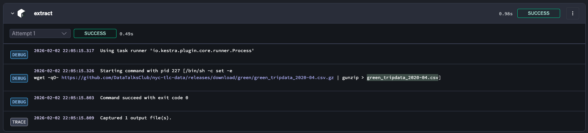
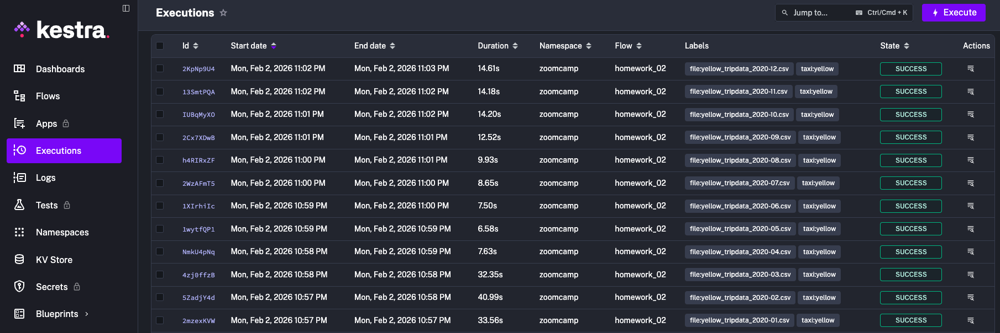
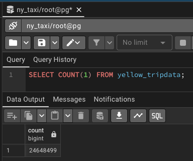
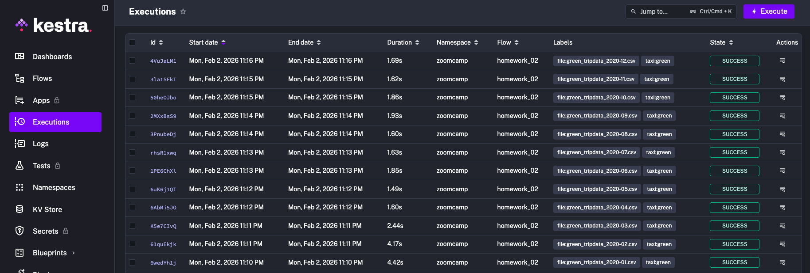
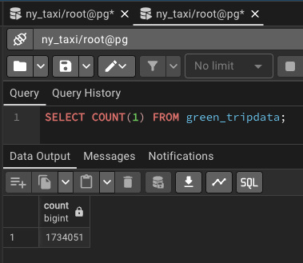
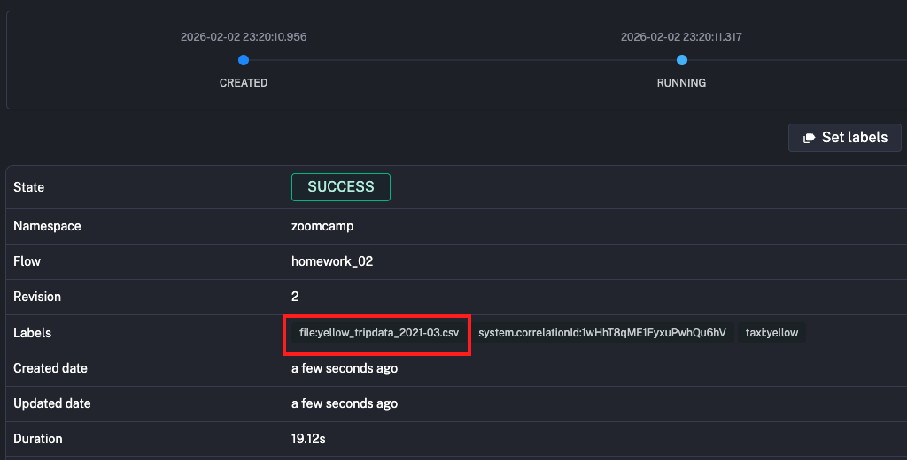
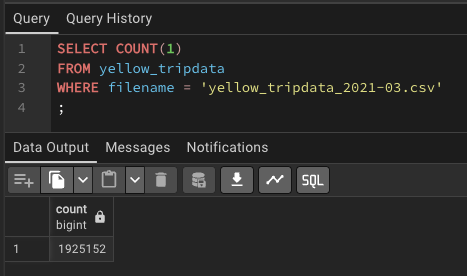

## Question 1: Within the execution for `Yellow` Taxi data for the year `2020` and month `12`: what is the uncompressed file size (i.e. the output file `yellow_tripdata_2020-12.csv` of the `extract` task)?

**Question**: Within the execution for `Yellow` Taxi data for the year `2020` and month `12`: what is the uncompressed file size (i.e. the output file `yellow_tripdata_2020-12.csv` of the `extract` task)?

**Solution**

```sh
# Download compressed file (deleted it later because too big)
wget https://github.com/DataTalksClub/nyc-tlc-data/releases/download/yellow/yellow_tripdata_2020-12.csv.gz

# Uncompress file
gunzip yellow_tripdata_2020-12.csv.gz

# Find file size in bytes
ls -l yellow_tripdata_2020-12.csv
# 134481400 bytes
# 134481400 / (1024 * 1024) = 128.3 MiB
```

**Answer**: 128.3 MiB

## Question 2: What is the rendered value of the variable `file` when the inputs `taxi` is set to `green`, `year` is set to `2020`, and `month` is set to `04` during execution?

**Solution**:

- Looking at the logs in the "extract" step, we can see the value of `{{render(vars.file)}}`

<p align="center">
	
</p>

**Answer**: `green_tripdata_2020-04.csv`

## Question 3: How many rows are there for the `Yellow` Taxi data for all CSV files in the year 2020?

**Solution**

- Use a bash script to run the workflow 12 times for all the months in `./scripts/run_yellow_2020.sh`.
  - Copy `curl` command from Kestra execute workflow and include basic authentication (username and password retrieved from `docker-compose.yaml` file)
  ```yaml
  # basic auth with kestra in docker-compose.yaml
  kestra:
  	server:
  	basicAuth:
  		username: "admin@kestra.io"
  		password: Admin1234
  ```

```sh
chmod 700 ./scripts/run_yellow_2020.sh
./scripts/run_yellow_2020.sh
```

- Executions in Kestra



- PgAdmin Row Count



**Answer**: 24,648,499

## Question 4: How many rows are there for the `Green` Taxi data for all CSV files in the year 2020?

**Solution**

- Use a bash script to run the workflow 12 times for all the months in `./scripts/run_green_2020.sh`.

```sh
chmod 700 ./scripts/run_green_2020.sh
./scripts/run_green_2020.sh
```

- Executions in Kestra



- PgAdmin Row Count



**Answer**: 1,734,051

## Question 5: How many rows are there for the `Yellow` Taxi data for the March 2021 CSV file?

**Solution**

- Execution in Kestra



- PgAdmin Row Count



**Answer**: 1,925,152

## Question 6: How would you configure the timezone to New York in a Schedule trigger?

**Solution**:

- Just did a Google Search and found the website: https://kestra.io/docs/workflow-components/triggers/schedule-trigger
- Docs mentioned:

```yaml
# A schedule that runs daily at midnight US Eastern time:
triggers:
  - id: daily
    type: io.kestra.plugin.core.trigger.Schedule
    cron: '@daily'
    timezone: America/New_York
```

**Answer**: Add a `timezone` property set to `America/New_York` in the `Schedule` trigger configuration.
