# Setup

```sh
python3 -m venv .venv && source .venv/bin/activate
pip install google-cloud-storage
python load_yellow_taxi_data.py
```

- Under BigQuery settings, changed location to `asia-southeast1` (Singapore).

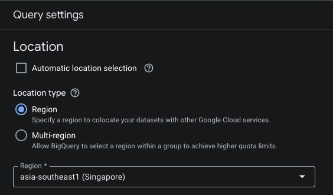

- Run `./bigquery/01-external-table.sql`
- External table allows you to query data **stored outside of BigQuery** (e.g., in Cloud Storage, Google Drive) **without importing it into BigQuery storage**.

# Homework Solutions

## Question 1: What is count of records for the 2024 Yellow Taxi Data?

**Solution**

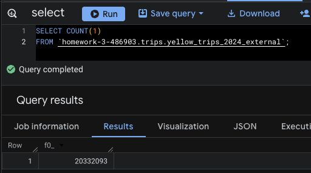

**Answer**: 20,332,093

## Question 2: Write a query to count the distinct number of PULocationIDs for the entire dataset on both the tables. What is the estimated amount of data that will be read when this query is executed on the External Table and the Table?

**Solution**

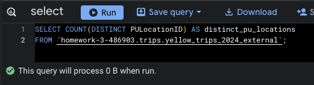
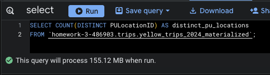

**Answer**: 0 MB for the External Table and 155.12 MB for the Materialized Table.

## Question 3: Write a query to retrieve the PULocationID from the table (not the external table) in BigQuery. Now write a query to retrieve the PULocationID and DOLocationID on the same table. Why are the estimated number of Bytes different?

**Solution**


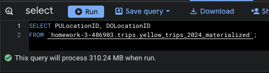

**Answer**: BigQuery is a columnar database, and it only scans the specific columns requested in the query. Querying two columns (PULocationID, DOLocationID) requires reading more data than querying one column (PULocationID), leading to a higher estimated number of bytes processed.

## Question 4: How many records have a fare_amount of 0?

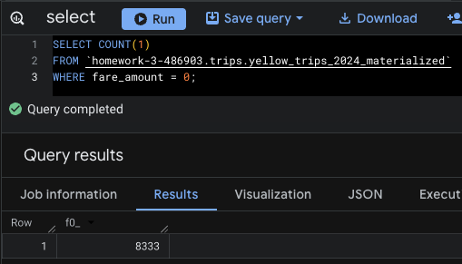

## Question 5: What is the best strategy to make an optimized table in Big Query if your query will always filter based on tpep_dropoff_datetime and order the results by VendorID (Create a new table with this strategy)

**Solution**:

- Use `tpep_dropoff_datetime` for **partitioning** because your queries always **filter by this column**. Partitioning reduces the amount of data scanned, as BigQuery only reads the relevant partitions.
- Use `VendorID` for **clustering** because your queries **order by** this column. Clustering organizes data within each partition by `VendorID`, making sorting faster.
- Create a new table with this strategy:

```sql
CREATE OR REPLACE TABLE `homework-3-486903.trips.yellow_trips_2024_optimized`
PARTITION BY DATE(tpep_dropoff_datetime)
CLUSTER BY VendorID AS
SELECT *
FROM `homework-3-486903.trips.yellow_trips_2024_materialized`;
```

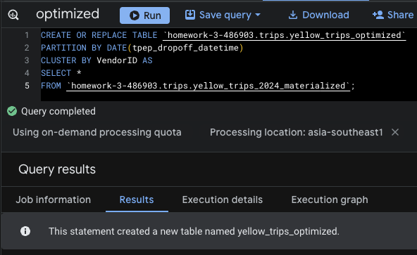

**Answer**: Partition by `tpep_dropoff_datetime` and Cluster on `VendorID`

## Question 6: Write a query to retrieve the distinct VendorIDs between `tpep_dropoff_datetime` 2024-03-01 and 2024-03-15 (inclusive). Use the materialized table you created earlier in your from clause and note the estimated bytes. Now change the table in the from clause to the partitioned table you created for question 5 and note the estimated bytes processed. What are these values?

**Solution**:

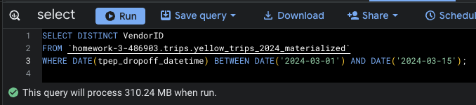
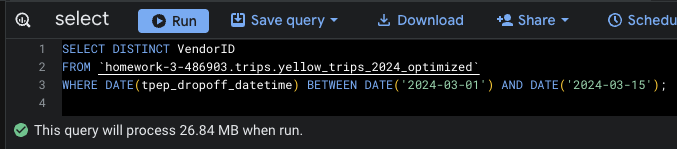

**Answer**: 310.24 MB for non-partitioned table and 26.84 MB for the partitioned table

## Question 7: Where is the data stored in the External Table you created?

**Solution**:

- In my `CREATE EXTERNAL TABLE` statement, the **GCP bucket** is specified in the `uris` option.

```sql
OPTIONS (
    format = 'PARQUET',
    uris = ['gs://dezoomcamp_hw3_2025_lowjiewei/yellow_tripdata_2024-*.parquet']
);
```

- This points to the GCP Bucket in `gs://dezoomcamp_hw3_2025_lowjiewei`.

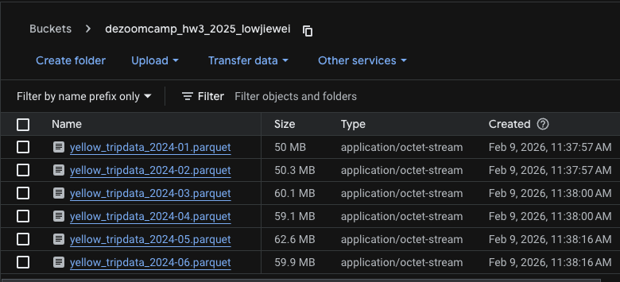

**Answer**: GCP Bucket

## Question 8: It is best practice in Big Query to always cluster your data. (True / False)

**Solution**:

Do not use clustering in BigQuery when:

- Tables are very small.
- Queries always perform full table scan.
- Clustered columns with low cardinality.

**Answer**: False

## Question 9: Write a `SELECT count(*)` query FROM the materialized table you created. How many bytes does it estimate will be read? Why?

**Solution**:

- It estimates to read 0 bytes because BigQuery stores table metadata on the total count of rows.

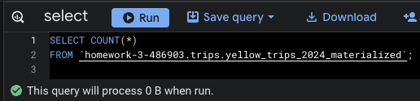

**Answer**: 0B
