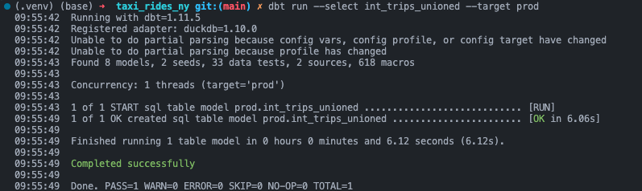
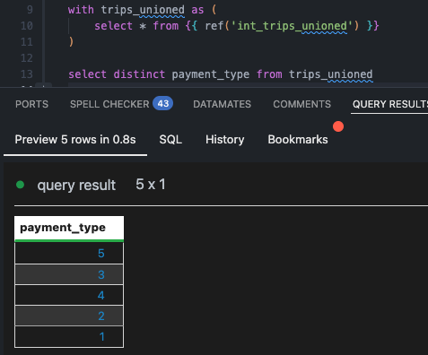
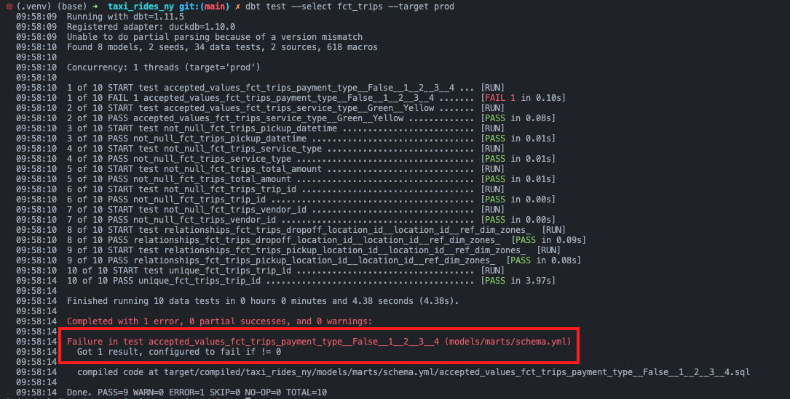
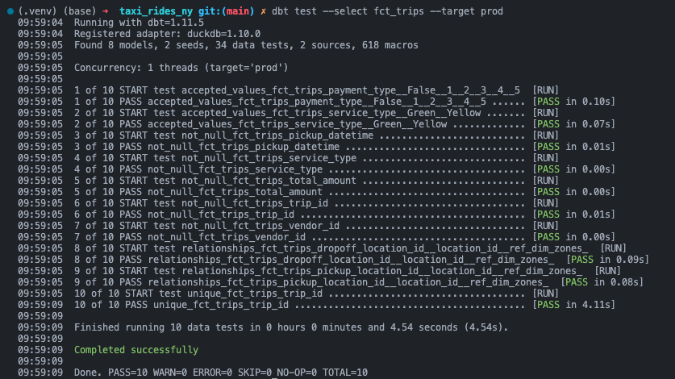
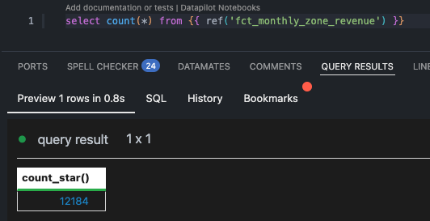
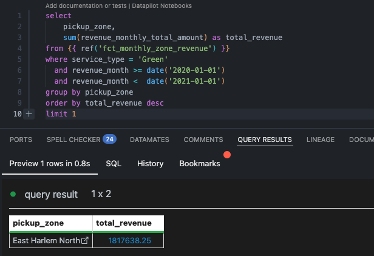
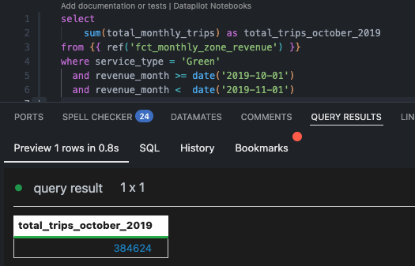
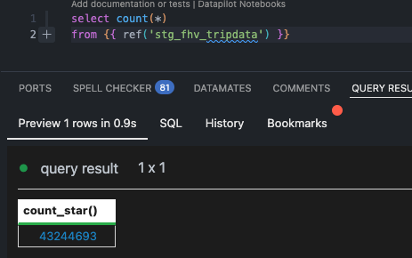

# Setup

```sh
# 1. Python Virtual Environment 
python3 -m venv .venv && source .venv/bin/activate
pip install duckdb dbt-duckdb

# 2. Ingest data
# Downloads yellow and green tripdata from 2019-2020, creates `prod` schema and loads raw data into DuckDB.
python ingest.py

# 3. Build dbt project
cd taxi_rides_ny
dbt deps
dbt retry
dbt build
dbt build --select stg_yellow_tripdata --target prod
dbt build --select stg_green_tripdata --target prod
dbt build --select int_trips_unioned --target prod
dbt build --select int_trips --target prod
dbt build --select fct_trips --target prod
```

# Homework 4: Analytics Engineering with dbt

## 1. dbt Lineage and Execution

Given a dbt project with the following structure:

```
models/
├── staging/
│   ├── stg_green_tripdata.sql
│   └── stg_yellow_tripdata.sql
└── intermediate/
    └── int_trips_unioned.sql (depends on stg_green_tripdata & stg_yellow_tripdata)
```

If you run `dbt run --select int_trips_unioned --target prod`, what models will be built?

**Solution**: 

- If no `+` sign is added before or after the selected dependency, then only `int_trips_unioned` will be ran.
- `+int_trips_unioned`: run with all upstream dependencies.
- `int_trips_unioned+`: run with all downstream dependencies.



**Answer**: `int_trips_unioned` only

## 2. dbt Tests

You've configured a generic test like this in your `schema.yml`:

```yaml
columns:
  - name: payment_type
    data_tests:
      - accepted_values:
          arguments:
            values: [1, 2, 3, 4, 5]
            quote: false
```

Your model `fct_trips` has been running successfully for months. A new value `6` now appears in the source data.

What happens when you run `dbt test --select fct_trips --target prod`?

**Solution**:

- First, I verified the distinct `payment_type` and there are only `[1, 2, 3, 4, 5]`:



- I attempt to run the unit test with `[1, 2, 3, 4]` to see the error:



- Next, I fixed the unit test with `[1, 2, 3, 4, 5]`



- When the unit test failed, the output stated: "Got 1 result, configured to fail if != 0"

**Answer**: dbt will fail the test, returning a non-zero exit code

## 3. Counting Records in `fct_monthly_zone_revenue`

After running your dbt project, query the `fct_monthly_zone_revenue` model.

What is the count of records in the `fct_monthly_zone_revenue` model?

**Solution**:



**Answer**: 12,184

## 4. Best Performing Zone for Green Taxis (2020)

Using the `fct_monthly_zone_revenue` table, find the pickup zone with the highest total revenue (`revenue_monthly_total_amount`) for Green taxi trips in 2020.

Which zone had the highest revenue?

**Solution**



**Answer**: East Harlem North

## 5. Green Taxi Trip Counts (October 2019)

Using the `fct_monthly_zone_revenue` table, what is the total number of trips (`total_monthly_trips`) for Green taxis in October 2019?

**Solution**



**Answer**: 384,624

## 6. Build a Staging Model for FHV Data

Create a staging model for the **For-Hire Vehicle (FHV)** trip data for 2019.

1. Load the [FHV trip data for 2019](https://github.com/DataTalksClub/nyc-tlc-data/releases/tag/fhv) into your data warehouse
2. Create a staging model `stg_fhv_tripdata` with these requirements:
   - Filter out records where `dispatching_base_num IS NULL`
   - Rename fields to match your project's naming conventions (e.g., `PUlocationID` → `pickup_location_id`)

What is the count of records in `stg_fhv_tripdata`?

**Solution**:

- `dbt build --select stg_fhv_tripdata --target prod`
- Inserted all 2019 fhv data and ran `ingest.py` script

```py
if __name__ == "__main__":
    # Update .gitignore to exclude data directory
    update_gitignore()

    con = duckdb.connect("taxi_rides_ny.duckdb")
    con.execute("CREATE SCHEMA IF NOT EXISTS prod")

    # Path to your FHV data
    fhv_path = Path("data/fhv")

    # Create a single DuckDB table by reading all CSV.GZ files
    con.execute(f"""
        CREATE OR REPLACE TABLE prod.fhv_tripdata AS
        SELECT * FROM read_csv_auto('{fhv_path}/*.csv.gz', compression='gzip', header=True, all_varchar=True)
    """)

    con.close()
```



**Answer**: 43,244,693